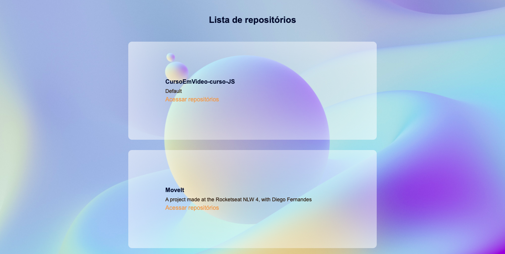

# Fundamentos do ReactJS

> Nesse módulo criaremos a estrutura base de uma aplicação React utilizando ferramentas como Webpack, Babel, Webpack Dev server, SASS, Source Maps, Fast Refresh e descobriremos conceitos importantes do React como componentes, propriedades, estados e hooks além de aplicar o TypeScript no nosso projeto para adicionar tipagem estática à aplicação.

GITHUB EXPLORER



---

## Configurando o ambiente

---

---

---

## RESUME

All installs:

Step 1: create folder and initialize the project

```
yarn init -y
npm init -y
```

dependencies:

```
yarn add react react-dom
npm install react react-dom
```

Developer dependencies:

```
yarn add -D @babel/cli @babel/core @babel/preset-env @babel/preset-react @babel/preset-typescript babel-loader webpack webpack-cli webpack-dev-server @pmmmwh/react-refresh-webpack-plugin  cross-env css-loader html-webpack-plugin node-sass react-refresh sass-loader style-loader typescript @types/react @types/react-dom
```

Step 2: package.json scripts

```json
"scripts": {
    "dev": "webpack serve",
    "build": "cross-env NODE_ENV=production webpack"
  },
```

Now you can run your project with: `yarn dev`
And build your project with: `yarn build`

---

---

---

### ReactJS

A instalação do react é feita da seguinte maneira:

Step 1: create a folder and open on vs code

Step 2:

```jsx
yarn add react react-dom
```

Pra que serve o React e o React Dom

React - Package that contains only the functionality necessary to define components.

React Dom - Package that serves as the entry point to the DOM and server renderers for React.

Step 3: create a public and src folder inside the project

Step 4: create a index.html with basic html 5 structure inside the public folder

---

### Babel

A instalação do babel é feita da seguinte maneira:

Step 1:

```jsx
yarn add -D @babel/core @babel/cli @babel/preset-env
```

Step 2: create a file on the root of project folder called babel.config.js

Step 3: inside the config file export his configuration passing presets inside de objects as a property and his value will be an array calling @babel/preset-env (inside quotes). Like this:

```js
module.exports = {
  presets: [
    '@babel/preset-env',
    '@babel/preset-typescript',
    [
      '@babel/preset-react',
      {
        runtime: 'automatic',
      },
    ],
  ],
}
```

Pra que serve o @babel/core, @babel/cli e o @babel/preset-env

@babel/core - Babel package, this package contains almost all babel features

@babel/cli - Package to let us run babel on the CLI (Command Line Interface)

@babel/preset-env - This package indentify which workspace my app is running, to convert my code, in the best form possible

To build any file with babel cli we run:

```jsx
yarn babel folder/targetfile.js --out-file dist/bundle.js
```

If we write a React's jsx code and try to create build with babel it will give us an error:

```jsx
SyntaxError: /Users/vilarezz/codefocus/ignite/reactjs/01-github-explorer/src/index.js:
Support for the experimental syntax 'jsx' isn't currently enabled (4:10):
```

That means that he can't understand html inside javascript we have to install a babel's plugin called @babel/preset-react and then add to the presets property array inside babel.config.js:

```jsx
module.exports = {
  presets: [
    '@babel/preset-env',
    [
      '@babel/preset-react',
      {
        runtime: 'automatic',
      },
    ],
  ],
}
```

Look that I added a new option called runtime w/ the value of 'automatic'

---

### Webpack

Let's get started:

Step 1: install his dependecies

```jsx
yarn add -D webpack webpack-cli babel-loader
```

Step 2: create a file called webpack.config.js on the root of the project folder and pass on him the following configuration:

```js
const path = require('path')
const HtmlWebpackPlugin = require('html-webpack-plugin')
const reactRefreshWebpackPlugin = require('@pmmmwh/react-refresh-webpack-plugin')

const isDevelopment = process.env.NODE_ENV !== 'production'

module.exports = {
  mode: isDevelopment ? 'development' : 'production',
  devtool: isDevelopment ? 'eval-source-map' : 'source-map',
  entry: path.resolve(__dirname, 'src', 'index.tsx'),
  output: {
    path: path.resolve(__dirname, 'dist'),
    filename: 'bundle.js',
  },
  resolve: {
    extensions: ['.js', '.jsx', '.ts', '.tsx'],
  },
  devServer: {
    contentBase: path.resolve(__dirname, 'public'),
    hot: true,
  },
  plugins: [
    isDevelopment && new reactRefreshWebpackPlugin(),
    new HtmlWebpackPlugin({
      template: path.resolve(__dirname, 'public', 'index.html'),
      inject: 'body',
    }),
  ].filter(Boolean),
  module: {
    rules: [
      {
        test: /\.(j|t)sx$/,
        exclude: /node_modules/,
        use: {
          loader: require.resolve('babel-loader'),
          options: {
            plugins: [
              isDevelopment && require.resolve('react-refresh/babel'),
            ].filter(Boolean),
          },
        },
      },
      {
        test: /\.scss/,
        exclude: /node_modules/,
        use: ['style-loader', 'css-loader', 'sass-loader'],
      },
      {
        test: /\.(png|svg|jpg|jpeg|gif)$/i,
        type: 'asset/resource',
      },
    ],
  },
}
```

Run it for build:

```js
yarn cross-env NODE_ENV=production webpack
```

Run it for dev:

```js
yarn webpack serve
```

---

### Reactjs Struture

Step 1: create a div with an id root inside of the index.html on the public folder

Step 2: on the entry file (index.jsx) write:

```tsx
import React from 'react',
import { render } from 'react-dom'
import { YourPage } from './YourPage'

render(<YourPage />, document.getElementById('#root'))
```

Step 3: run:

```js
yarn webpack serve
```

Step: 4: import with the script tag the bundle.js inside the dist folder on the index.html, will look like this:

```html
<!DOCTYPE html>
<html lang="en">
  <head>
    <meta charset="UTF-8" />
    <meta http-equiv="X-UA-Compatible" content="IE=edge" />
    <meta name="viewport" content="width=device-width, initial-scale=1.0" />
    <title>Github Explorer</title>
  </head>
  <body>
    <div id="root"></div>

    <script src="../dist/bundle.js"></script>
  </body>
</html>
```

---

### Typescript

Step 1: Install it

```js
yarn add -D typescript @types/react @types/react-dom @babel/preset-typescript
```

Step 2: Generate/Create a **tsconfig.json** file

Run:

```
yarn tsc --init
```

Change the defaults to this, inside of the file generated:

```json
{
  "compilerOptions": {
    "lib": ["dom", "dom.Iterable", "esnext"],
    "allowJs": true,
    "jsx": "react-jsx",
    "noEmit": true,
    "isolatedModules": true,
    "strict": true,
    "moduleResolution": "node",
    "resolveJsonModule": true,
    "allowSyntheticDefaultImports": true,
    "esModuleInterop": true,
    "skipLibCheck": true,
    "forceConsistentCasingInFileNames": true
  },
  "include": ["src"]
}
```

Then change all jsx to tsx (from Javascript to Typescript)

Made in Rocketseat Ignite ReactJs
Done by Gil Vilares

---

> Conection center

<a href="https://soundcloud.com/vilarezz" style="display: flex; justify-content: center;align-items: center; text-decoration: none; color: #e69d58;">
  
 <p>Instagram</p>
</a>

<a href="https://twitter.com/vilarezz" style="display: flex;  justify-content: center; align-items: center; text-decoration: none; color: #e69d58;">
  
 <p>Twitter</p>
</a>

<a href="https://youtube.com/vilarezz0" style="display: flex;  justify-content: center; align-items: center; text-decoration: none; color: #e69d58;">
  
 <p>Youtube</p>
</a>

<a href="https://spotify.com/vilarezz" style="display: flex;  justify-content: center; align-items: center; text-decoration: none; color: #e69d58;">
  
 <p>Spotify</p>
</a>

<a href="https://music.apple.com/vilarezz" style="display: flex;  justify-content: center; align-items: center; text-decoration: none; color: #e69d58;">
  
 <p>Apple Music</p>
</a>

<a href="https://soundcloud.com/vilarezz" style="display: flex;  justify-content: center; align-items: center; text-decoration: none; color: #e69d58;">
  
 <p>Soundcloud</p>
</a>

<a href="https://facebook.com/vilarezz0" style="display: flex;  justify-content: center; align-items: center; text-decoration: none; color: #e69d58;">
  
 <p>Facebook</p>
</a>

<br>
<p style="display: flex;  justify-content: center; align-items: center; text-decoration: none; color: #e69d58;">
℗ 2021 Vilarezz <br />
© 2021 Vilarezz
</p>
